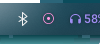

# RecordAudioOutputHyprland
A variation of JayXT's [RecordAudioOutput](https://github.com/JayXT/RecordAudioOutput) script for [Hyprland](https://github.com/hyprwm/Hyprland). Adds [Waybar](https://github.com/Alexays/Waybar) integration so that an indicator appears when the script is active:



Defaults to using ffmpeg to record audio, but parec or pw-record can be used as well (see script on what lines to modify).

## How to use

Add [record_audio_output_Hyprland](record_audio_output_Hyprland) somewhere, like `~/scripts`. 

In your waybar config file (`~/.config/waybar/config`), add

```
"custom/audio-recorder": {
		"format": "{}",
		"exec": "echo ''",
		"tooltip": "false",
		"exec-if": "pgrep ffmpeg", // replace ffmpeg with parec or pw-record if using those instead
		"interval": "once",
        "on-click": "exec $HOME/scripts/record_audio_output_Hyprland",
		"signal": 8
	},
```

The module can be styled in `~/.config/waybar/style.css` like so:

```
#custom-audio-recorder {
    color: #fe9be4;
    padding: 0 10px;
}
```

Now when the script is running, a recording icon will appear in waybar (be sure to have a [Nerd Font](https://www.nerdfonts.com/font-downloads) installed or replace the icon). I recommend binding the script to a keybind. For example, in `~/.config/hypr/hyprland.conf`, add `bind = SUPER, R, exec, $HOME/scripts/record_audio_output_Hyprland # Record audio and copy to clipboard` to bind the script to SUPER + R. Now when the keybind is pressed, recording will start if not already and stop if currently recording. Recording can also be stopped by clicking on the indicator in waybar.

Tested in Nobara 42 + Hyprland + PipeWire.